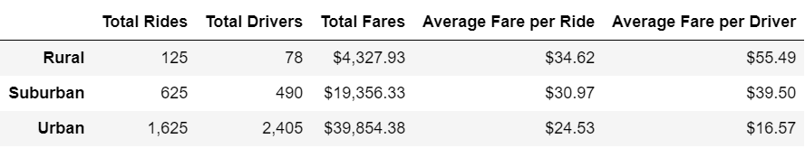

# PyBer Analysis

## Project Overview
PyBer is an up-and-coming rideshare platform that serves various diverse cities, ranging from rural to urban landscapes. They want to connect people and their destinations with dispatching services and friendly drivers who make the experience more than just a car ride. PyBer believes that it can become the de facto ride-sharing app through its efficient platform and friendly drivers. Our initial analysis determined three city types that PyBer serves, including urban, suburban, and rural. We compared each city type by visualizing specific parameters, such as the average fare and the total number of rides for each city type. We determined that urban cities have the most drivers, rides and produced the most revenue through our initial analysis. Our current objective is to determine the total weekly fare for each city type and visualize the data to tell a compelling story. Through our exploratory research, the company will decide how to improve operations moving forward. 

## Resources
- Data Source: city_data.csv, ride_data.csv
- Software: Python 3.7.6, Jupyter Notebook

## Results
### Summary DataFrame Analysis

The summary DataFrame we produced with the pandas module highlights the stark disparities among the city types. Urban cities make twice as many fares as suburban cities and nine times more than rural cities. Urban cities also have significantly more drivers than their counterparts. However, the average fare per driver in urban cities is much lower than that of other city types. Although rural cities have the least amount of drivers, rides completed, and total fares, it has the highest average fare per ride and driver. One possible explanation for this phenomenon could be the nature of rides in each city type. Urban cityscapes are much more compact, translating to much shorter rides than those in rural areas. Assuming ride prices are dictated by supply, demand, and the duration of a trip, we can expect the average fare per ride in urban cities to be lower considering the abundance of drivers and shorter voyages. 

### Chart Analysis

The chart we produced to display the total fare by city type solidifies the dominance that urban cities have over the other city types. They make much more revenue regardless of the time of the year. The amount of fare produced in urban cities seems notably higher during certain weeks in February and March. There are a couple of down spikes in urban areas during March, which is also worth noting. Suburban and rural cities appear to share an uptick in fares in late February, along with urban cities. We can also see that suburban cities have an upward trend during mid-April. Rural towns have two notable peaks, with one in late February and another at the beginning of April.

## Summary
After exploring the PyBer data and elucidating the significant disparities among each city type, we can adjust the PyBer business model to create a more inclusive rideshare app capable of serving any community regardless of its landscape. The average fare in rural cities is considerably high, which may deter price-sensitive patrons in those areas from using PyBer's services. Perhaps the short supply of drivers is not meeting the demand in rural areas, causing significantly higher prices. As a remedy, we can launch a campaign to increase the number of drivers in rural areas. PyBer should incentivize drivers in urban areas to make trips to rural towns to increase usage among price-sensitive customers. By doing so, PyBer can facilitate a network effect where more people in rural areas start using PyBer more often due to increased reliability and reasonable prices. Drivers can also earn more money by completing longer trips in rural areas rather than cheaper short trips in urban areas. 
Pyber should also disperse its drivers in urban areas to the surrounding suburban areas to ensure that the demand is met in those areas. Suburban areas during March appear to have lower total fares. Pyber should create a campaign to increase user demand during those periods. It is also worth noting that the weather and seasonal changes may impact the total fare produced by each city type. PyBer can include an exploration option in its app where people in the city can discover rural or suburban areas with captivating natural scenery. They can then make trips to those areas, which will help PyBer establish a more significant presence in non-urban areas. 
